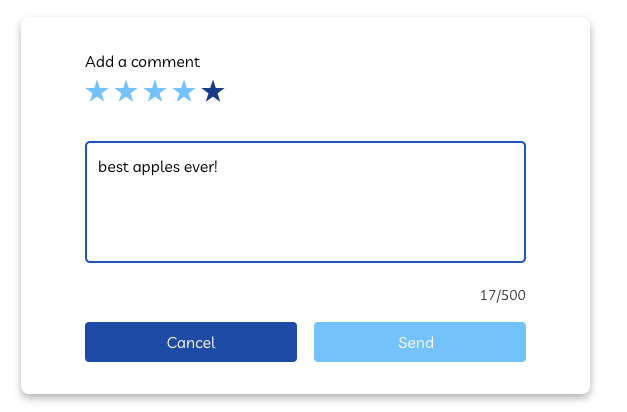
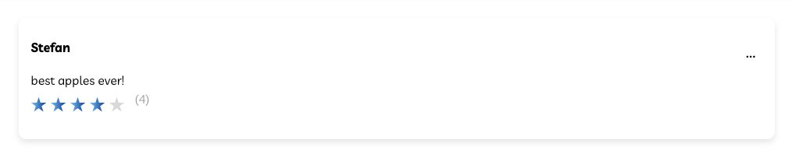
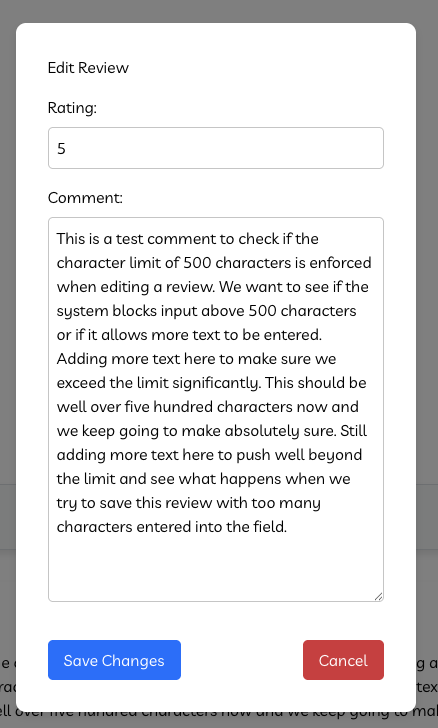
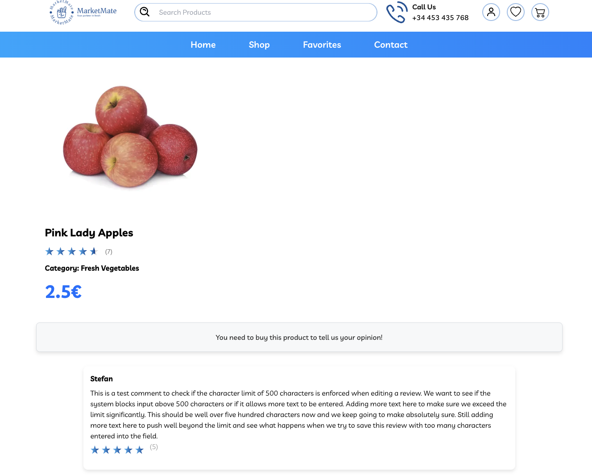
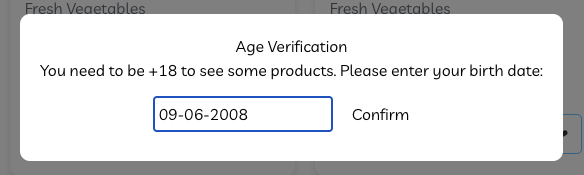
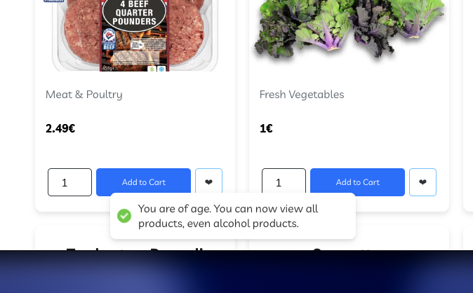
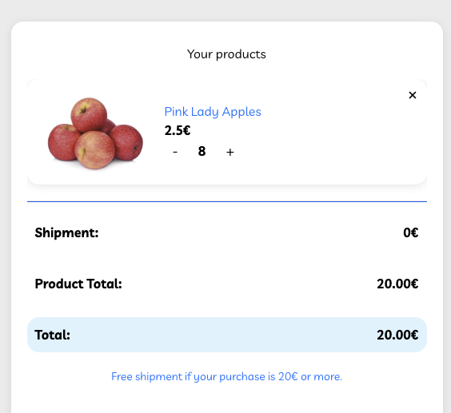
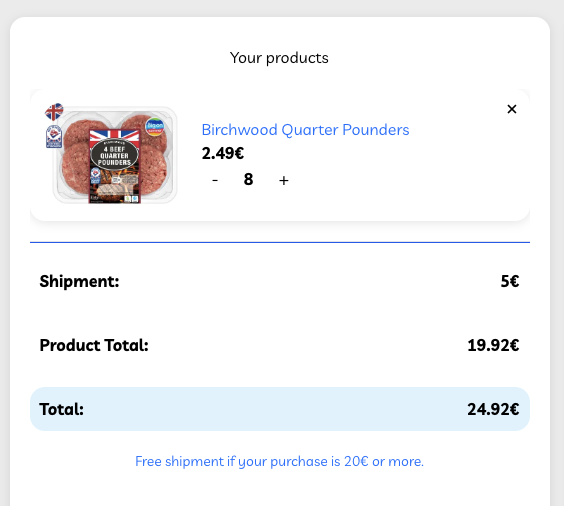
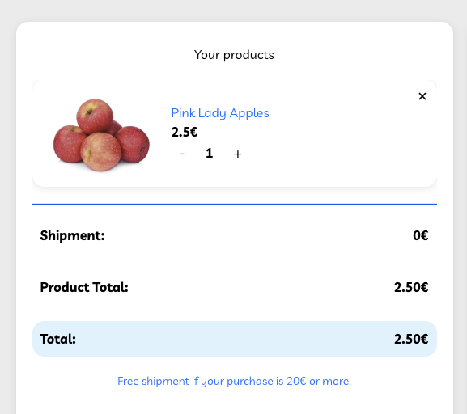

# **Test Execution Report: Market Mate Webshop – New Features**

---

**Date:** 09-06-2026
**Tester:** Stefan Henning
**Environment:** Test
**Application:** Market Mate
**Browser:** Chrome
**Operating System:** MacOS
**Base URL:** https://grocerymate.masterschool.com

---

## **Preconditions**

- A test account was created prior to testing: registration flow was completed successfully.
- To test the rating feature, products must be purchased first. Several products were bought during the test session to enable rating tests.
- Age verification uses a session cookie. Cookies were cleared between relevant test cases to reset the modal.

---

## **1. Product Rating System**

### **Scenario 1.1: Registered user submits a 5-star rating without text**

**Precondition:** User is logged in and has purchased the product.

| Step# | Action | Expected Outcome | OK/NOK | URL | Link to Issue |
|---|---|---|---|---|---|
| 1 | Navigate to a purchased product page | Product detail page is displayed | OK | /product/66b3a57b3fd5048eacb479c8 | |
| 2 | Scroll down to the rating section | Rating widget is visible with 5 stars and a text field | OK | /product/66b3a57b3fd5048eacb479c8 | |
| 3 | Select 5 stars, leave text field empty | 5 stars are selected | OK | /product/66b3a57b3fd5048eacb479c8 | |
| 4 | Click Submit | Rating is saved and displayed on the product page | OK | /product/66b3a57b3fd5048eacb479c8 | |

**After submit:** The 5-star rating is saved and correctly displayed on the product page.

---

### **Scenario 1.2: Registered user submits a rating with written feedback**

**Precondition:** User is logged in and has purchased the product.

| Step# | Action | Expected Outcome | OK/NOK | URL | Link to Issue |
|---|---|---|---|---|---|
| 1 | Navigate to a purchased product page | Product detail page is displayed | OK | /product/66b3a57b3fd5048eacb4799b| |
| 2 | Select 4 stars and enter text feedback | Stars selected, text visible in field | OK | /product/66b3a57b3fd5048eacb4799b | |
| 3 | Click Submit | Rating and text are both saved and displayed | NOK | /product/66b3a57b3fd5048eacb4799b | [#3](https://github.com/Stfn-H/software-testing-portfolio/issues/3)
 |
| 4 | Click Edit and re-enter the same text | Text is saved and displayed after editing | OK | /product/66b3a57b3fd5048eacb4799b | |

**Before submit:** Rating form with 4 stars and written feedback entered.

**After submit:** Only the star rating is displayed – the written feedback is missing.

**After edit:** Both stars and text are correctly displayed after editing the review.

**Note:** Text is not displayed after initial submission. It only appears correctly after editing the review. See [Issue #3](https://github.com/Stfn-H/software-testing-portfolio/issues/3).

---

### **Scenario 1.3: Guest user cannot submit a rating**

**Precondition:** User is logged out.

| Step# | Action | Expected Outcome | OK/NOK | URL | Link to Issue |
|---|---|---|---|---|---|
| 1 | Navigate to any product page | Product detail page is displayed | OK | /product/66b3a57b3fd5048eacb4799b | |
| 2 | Scroll down to the rating section | Existing ratings are visible but no option to submit | OK | /product/66b3a57b3fd5048eacb4799b | |
| 3 | Verify no submit option is available | No rating form is shown for guest users | OK | /product/66b3a57b3fd5048eacb4799b | |

**Note:** Ratings are visible to all users. To submit a rating, a user must be logged in AND must have purchased the product. Guest users see no submit option at all. Logged-in users who have not purchased the product see the message "You need to buy this product to tell us your opinion."

---

### **Scenario 1.4: Average rating is calculated correctly**

**Precondition:** Product has multiple ratings from different users.

| Step# | Action | Expected Outcome | OK/NOK | URL | Link to Issue |
|---|---|---|---|---|---|
| 1 | Navigate to a product with multiple ratings | Product detail page is displayed | OK | /product/66b3a57b3fd5048eacb4799b | |
| 2 | Read all individual ratings: 1, 5, 5, 5, 3, 4, 5 | Individual ratings are visible | OK | /product/66b3a57b3fd5048eacb4799b | |
| 3 | Verify displayed average (28 ÷ 7 = 4.0) | Average displayed as 4 stars | OK | /product/66b3a57b3fd5048eacb4799b | |

**Note:** The star display updates dynamically and accurately reflects the average visually, not just as a number.

---

### **Scenario 1.5: Minimum and maximum star rating (BVA)**

**Precondition:** User is logged in and has purchased the product.

| Step# | Action | Expected Outcome | OK/NOK | URL | Link to Issue |
|---|---|---|---|---|---|
| 1 | Select 1 star and submit | 1-star rating is accepted and saved | OK | /product/66b3a57b3fd5048eacb4799b | |
| 2 | Delete the review, select 5 stars and submit | 5-star rating is accepted and saved | OK | /product/66b3a57b3fd5048eacb4799b | |
| 3 | Attempt to submit with 0 stars | Submission is blocked | OK | /product/66b3a57b3fd5048eacb4799b | |

---

### **Scenario 1.6: Submit without selecting stars is blocked**

**Precondition:** User is logged in and has purchased the product.

| Step# | Action | Expected Outcome | OK/NOK | URL | Link to Issue |
|---|---|---|---|---|---|
| 1 | Navigate to the rating form | Rating form is displayed | OK | /product/66b3a57b3fd5048eacb4799b | |
| 2 | Leave stars unselected and click Submit | Error message "Invalid input for the field rating" is displayed | OK | /product/66b3a57b3fd5048eacb4799b | |

---

### **Scenario 1.7: Text without stars is blocked**

**Precondition:** User is logged in and has purchased the product.

| Step# | Action | Expected Outcome | OK/NOK | URL | Link to Issue |
|---|---|---|---|---|---|
| 1 | Enter text feedback without selecting stars | Text is entered in the field | OK | /product/66b3a57b3fd5048eacb4799b | |
| 2 | Click Submit | Submission is blocked with error message | OK | /product/66b3a57b3fd5048eacb4799b | |

**Note:** Cancel button on the rating form has no function – it does not close the form or clear the input. See [Issue #9](https://github.com/Stfn-H/software-testing-portfolio/issues/9).

---

### **Scenario 1.8: 500-character limit enforcement (BVA)**

**Precondition:** User is logged in and has purchased the product.

| Step# | Action | Expected Outcome | OK/NOK | URL | Link to Issue |
|---|---|---|---|---|---|
| 1 | Enter text exceeding 500 characters in the initial rating form | Text is cut off at 500 characters | OK | /product/66b3a57b3fd5048eacb4799b | |
| 2 | Submit the review, then click Edit | Edit form opens | OK | /product/66b3a57b3fd5048eacb4799b | |
| 3 | Enter text exceeding 500 characters in the edit form | Text should be cut off at 500 characters | NOK | /product/66b3a57b3fd5048eacb4799b | [#4](https://github.com/Stfn-H/software-testing-portfolio/issues/4)
 |
| 4 | Save the review | Text over 500 characters is saved and displayed | NOK | /product/66b3a57b3fd5048eacb4799b | [#4](https://github.com/Stfn-H/software-testing-portfolio/issues/4) |

**Edit form:** Text field during editing showing input exceeding 500 characters with no character counter or restriction visible.

**Saved review:** The review is saved and displayed with text exceeding the 500-character limit.

**Note:** The 500-character limit is enforced on initial submission but not when editing. See [Issue #4](https://github.com/Stfn-H/software-testing-portfolio/issues/4).

---

## **2. Age Verification for Alcoholic Products**

### **Scenario 2.1: User exactly 18 years old is granted access**

**Precondition:** Cookies cleared so age verification modal appears.

| Step# | Action | Expected Outcome | OK/NOK | URL | Link to Issue |
|---|---|---|---|---|---|
| 1 | Navigate to the shop | Age verification modal appears | OK | /store | |
| 2 | Enter 09-06-2008 (exactly 18 today) | Date is accepted | OK | /store | |
| 3 | Click Confirm | Access to the shop including alcoholic products is granted | OK | /store | |

**Age verification modal:** Date 09-06-2008 entered in the modal before confirming.

**After confirmation:** Shop is accessible after confirming age of exactly 18.

---

### **Scenario 2.2: User 17 years old is denied access**

**Precondition:** Cookies cleared so age verification modal appears.

| Step# | Action | Expected Outcome | OK/NOK | URL | Link to Issue |
|---|---|---|---|---|---|
| 1 | Navigate to the shop | Age verification modal appears | OK | /store | |
| 2 | Enter 10-06-2008 (18 tomorrow) | Date is not accepted | OK | /store | |
| 3 | Click Confirm | Access is denied with appropriate message | OK | /store | |

---

### **Scenario 2.3: User well above 18 is granted access**

**Precondition:** Cookies cleared so age verification modal appears.

| Step# | Action | Expected Outcome | OK/NOK | URL | Link to Issue |
|---|---|---|---|---|---|
| 1 | Navigate to the shop | Age verification modal appears | OK | /store | |
| 2 | Enter a date of birth for a 30-year-old user | Date is accepted | OK | /store | |
| 3 | Click Confirm | Access is granted | OK | /store | |

---

### **Scenario 2.4: Modal cannot be closed without input**

**Precondition:** Cookies cleared so age verification modal appears.

| Step# | Action | Expected Outcome | OK/NOK | URL | Link to Issue |
|---|---|---|---|---|---|
| 1 | Navigate to the shop | Age verification modal appears | OK | /store | |
| 2 | Attempt to close modal by clicking outside or pressing ESC | Modal cannot be closed | OK | /store | |
| 3 | Click Confirm with empty field | Access is denied | OK | /store | |

---

### **Scenario 2.5: Invalid characters in age field**

**Precondition:** Cookies cleared so age verification modal appears.

| Step# | Action | Expected Outcome | OK/NOK | URL | Link to Issue |
|---|---|---|---|---|---|
| 1 | Navigate to the shop | Age verification modal appears | OK | /store | |
| 2 | Enter "ab-cd-efgh" in the date field | Input is rejected or an error message is displayed indicating invalid format. | NOK | /store | [#6](https://github.com/Stfn-H/software-testing-portfolio/issues/6) |
| 3 | Click Confirm | Access is denied | OK | /store |  |

**Note:** No specific error message is shown for invalid input format – the user receives the same response as an underage user, with no indication that the format was wrong. See [Issue #6](https://github.com/Stfn-H/software-testing-portfolio/issues/6).

---

### **Scenario 2.6: Deep link bypasses age verification**

**Precondition:** Cookies cleared so age verification has not been completed.

| Step# | Action | Expected Outcome | OK/NOK | URL | Link to Issue |
|---|---|---|---|---|---|
| 1 | Copy a direct URL to an alcoholic product page | URL is copied | OK | | |
| 2 | Paste the URL directly into the browser | Age verification modal should appear | NOK | /product/66b3a57b3fd5048eacb47a8b | [#8](https://github.com/Stfn-H/software-testing-portfolio/issues/8) |
| 3 | Verify product page is accessible without age check | Product page loads without any age verification | NOK | /product/66b3a57b3fd5048eacb47a8b | [#8](https://github.com/Stfn-H/software-testing-portfolio/issues/8) |

**Note:** The age verification modal does not appear when navigating directly to a product via a deep link. See [Issue #8](https://github.com/Stfn-H/software-testing-portfolio/issues/8).

---

## **3. Shipping Cost Logic**

### **Scenario 3.1: Cart total exactly at threshold (€20.00) results in free shipping**

| Step# | Action | Expected Outcome | OK/NOK | URL | Link to Issue |
|---|---|---|---|---|---|
| 1 | Add products to cart until total is exactly €20.00 | Cart total shows €20.00 | OK | /checkout | |
| 2 | Navigate to cart | Shipping is displayed as €0 | OK | /checkout | |

**Cart at threshold:** Cart showing exactly €20.00 total with €0 shipping.

---

### **Scenario 3.2: Cart total just below threshold (€19.92) incurs shipping fee**

| Step# | Action | Expected Outcome | OK/NOK | URL | Link to Issue |
|---|---|---|---|---|---|
| 1 | Add products to cart until total is €19.92 | Cart total shows €19.92 | OK | /checkout | |
| 2 | Navigate to cart | Shipping is displayed as €5.00 | OK | /checkout | |

**Cart below threshold:** Cart showing €19.92 total with €5.00 shipping fee applied.

---

### **Scenario 3.3: Cart total well below threshold incurs shipping fee**

| Step# | Action | Expected Outcome | OK/NOK | URL | Link to Issue |
|---|---|---|---|---|---|
| 1 | Add a single product worth €2.49 to cart | Cart total shows €2.49 | OK | /store | |
| 2 | Navigate to cart | Shipping is displayed as €5.00 | OK | /checkout | |

**Note:** Price was displayed as €2.5 instead of €2.50. See [Issue #1](https://github.com/Stfn-H/software-testing-portfolio/issues/1).

---

### **Scenario 3.4: Cart total well above threshold results in free shipping**

| Step# | Action | Expected Outcome | OK/NOK | URL | Link to Issue |
|---|---|---|---|---|---|
| 1 | Add products to cart until total exceeds €20 significantly | Cart total is well above €20 | OK | /store | |
| 2 | Navigate to cart | Shipping is displayed as €0 | OK | /checkout | |

---

### **Scenario 3.5: Shipping cost updates dynamically**

| Step# | Action | Expected Outcome | OK/NOK | URL | Link to Issue |
|---|---|---|---|---|---|
| 1 | Add products until cart crosses €20 threshold | Shipping updates to €0 | OK | /checkout | |
| 2 | Remove products until cart drops below €20 | Shipping should update back to €5 | NOK | /checkout | [#10](https://github.com/Stfn-H/software-testing-portfolio/issues/10) |
| 3 | Reload the page | Shipping correctly shows €5 after reload | OK | /checkout | |

**Shipping not updated:** Cart showing €2.50 total but still displaying €0 shipping after reducing quantity.

**Note:** Shipping cost does not update dynamically when reducing cart below the threshold. It only corrects itself after a page reload. Since checkout happens directly in the cart without a summary page, users may be able to check out with €0 shipping even when their cart is below €20. See [Issue #10](https://github.com/Stfn-H/software-testing-portfolio/issues/10).

---

### **Scenario 3.6: Voucher code impact on shipping threshold**

**Precondition:** A voucher/discount code is required for this test.

| Step# | Action | Expected Outcome | OK/NOK | URL | Link to Issue |
|---|---|---|---|---|---|
| 1 | Look for a voucher code field in the cart or checkout | Voucher field should be visible | N/A | /checkout | |

**Note:** No voucher code field was found on the website. This test case could not be executed. Marked as **Not Testable**.

---

## **Additional Findings During Exploratory Testing**

The following bugs were discovered outside the planned test cases during exploratory testing:

- **Bug #2:** Products remain in the cart after a completed purchase – the cart is not cleared after checkout.
- **Bug #5:** The date input field in the age verification modal does not auto-insert hyphens, despite the placeholder showing DD-MM-YYYY format. Entering a date without hyphens results in incorrect behavior.
- **Bug #7:** The age verification modal accepts the birth year 1900, meaning a user claiming to be 126 years old is granted access. No upper age limit validation exists.